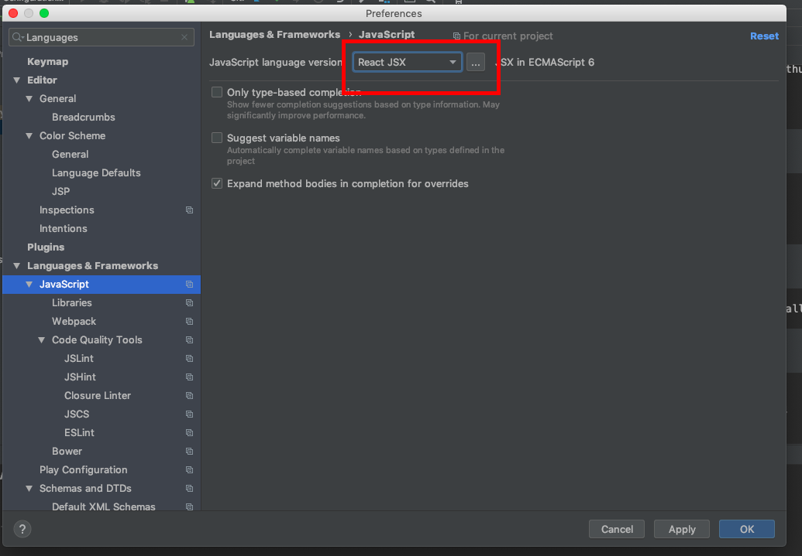

##定义变量
var：全局变量
let：局部变量
const：常量不可改

##环境配置
安装homebrew

```
ruby -e "$(curl -fsSL https://raw.githubusercontent.com/Homebrew/install/master/install)" 
brew -v

```
安装node
```
brew link node
brew uninstall node
brew install node
```
Yarn 的安装与使用
```
curl -o- -L https://yarnpkg.com/install.sh | bash  
```

配置react
```
 yarn init -y
yarn add umi --dev #项目中添加umi的依赖

```

#命令
```
//编译
umi dev

//构建，在dist生成普通html、js文件
umi build
```

#支持JSX语法


#添加umi-plugin-react插件 
umi-plugin-react插件是umi官方基于react封装的插件，包含了13个常用的进阶功能。
 具体可查看:https://umijs.org/zh/plugin/umi-plugin-react.html
 ```
 #添加插件
 tyarn add umi-plugin-react --dev
 
 ```
 添加成功:


